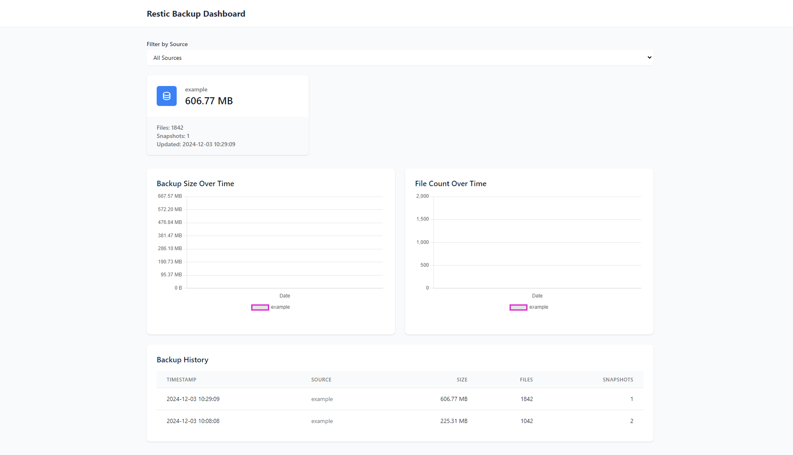

# 📊 GORestic
GORestic provides a simple dashboard for monitoring your Restic backup statistics. It offers a simple yet powerful way to track backup sizes, file counts, and snapshot statistics across multiple backup sources.



## Features
Every feature in GORestic is designed with simplicity and efficiency in mind:

- 📊 Real-time visualization of backup statistics
- 📈 Historical data tracking with interactive charts
- 🔑 Multiple API key support for different backup sources
- 🔄 Automatic data refresh
- 🎯 Source filtering capabilities
- 🐳 Docker support for containerized environments

## Install

### Binary
Download and run the binary:

```bash
# Download the latest release
curl -L -o gorestic https://github.com/vanvanni/gorestic/releases/latest/download/gorestic

# Make it executable
chmod +x gorestic

# Run it
./gorestic
```

On first run, GORestic will create a default configuration file at `~/.config/gorestic/config.toml`.

### Docker (SOON)
Run using Docker:

```bash
docker run -d \
  --name gorestic \
  -p 2010:2010 \
  -v $HOME/.config/gorestic:/config \
  vanvanni/gorestic
```

## Configuration
GORestic uses a TOML configuration file located at `~/.config/gorestic/config.toml`:

```toml
[server]
port = 2010
username = 'admin'
password = '2cb18a05653b8cad'

[storage]
path = '/root/.config/gorestic/stats.json'

[api_keys]
[api_keys.example]
key = 'e20b98bf9144ad5ef093fdcdb439dedd'
name = 'Example Backup'
description = 'Default API key generated on first run'
created_at = '2024-12-03'
```

### API Usage
Send backup statistics using curl:

```bash
curl -X POST "http://localhost:2010/api/stats" \
    -H "X-API-Key: your-api-key" \
    -H "Content-Type: application/json" \
    -d '{
        "total_size": 636249527,
        "total_file_count": 1842,
        "snapshots_count": 1
    }'
```

### Restic Integration
Add this to your backup script:

```bash
# Get statistics
STATS=$(restic stats --json latest)

# Send to GORestic
curl -X POST "http://localhost:2010/api/stats" \
    -H "X-API-Key: your-api-key" \
    -H "Content-Type: application/json" \
    -d "$STATS"
```

## Security
- Use HTTPS if exposing to the internet
- Change default admin password
- Use strong API keys
- Keep backup statistics separate from backup data

## License
MIT License - feel free to use and modify as you like!